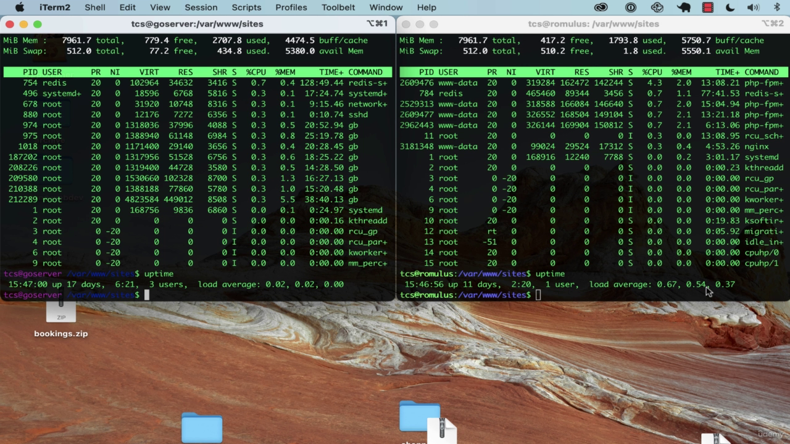

# udemy building modern web applications with go

This repository content all my practice, tips, and techniques while learning Udemy course: [Building Modern Web Applications with Go (Golang)](https://www.udemy.com/course/building-modern-web-applications-with-go/)

I make each section as a branch, so you can easily navigate to the branch you want to see.

Enjoy learning!

## Section 1: Introduction

- why go?
  - compiled language, single binary file (fast)
  - no runtime to worry about
  - statically typed, so no surprises at runtime
  - object-oriented (sort of), but not class based
  - concurrency built in
  - garbage collected
  - cross-platform
  - excellent package management and testing built in
  - great community
  - great tooling
  - great documentation
  - great standard library
  - great performance
  - great error handling
  - great for microservices
  - great for web applications
  - great for devops
  - great for CLIs
  - great for data science
  - easy to learn
  - and more...

  now, let look at examples:
  - the left terminal is running a Go program, and the right terminal is running a PHP program. then we run command `top` and `uptime` to see load of each server:

  

  - as we can see that the server that running Go program has a lower load than the server that running PHP program. this is because Go is a compiled language, so it's faster than PHP, which is an interpreted language.

- install Go:
  - [download Go](https://golang.org/dl/)
  - [install Go](https://golang.org/doc/install)
  - [set up Go workspace](https://golang.org/doc/code.html#Workspaces)
- 