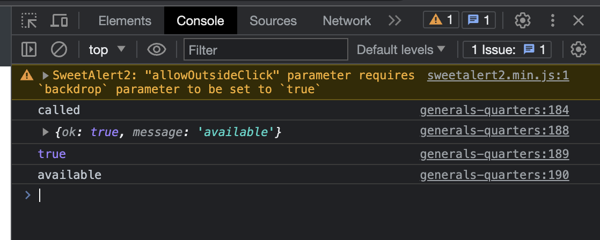

# Section 8: Converting our HTML to Go Templates, and creating handlers

## Lesson #063: Sending and Processing an AJAX request

- first we need to refactor our project
- replace all path of imported packages from `062-creating-a-handler-that-return-json`
  to `063-sending-and-processing-an-ajax-request`
- then edit go mod file

```shell
go mod edit -module github.com/SarathLUN/udemy-building-modern-web-applications-with-go/section-08/063-sending-and-processing-an-ajax-request
```

- in this lesson we will implement AJAX on the popup form in page `/generals-quarters`
- as this page is calling to JS function `custom` in the main js part in file `base.layout.tmpl`
- first we catch the result from popup form and check to make sure it not dismiss or blank
- then we need to execute the callback function by providing the result as parameter

```javascript
async function custom(c) {
    const {
        msg = "",
        title = "",
    } = c;

    const {value: result} = await Swal.fire({
        title: title,
        html: msg,
        backdrop: false,
        focusConfirm: false,
        showCancelButton: true,
        willOpen: () => {
            const elem = document.getElementById("reservation-dates-modal");
            const rp = new DateRangePicker(elem, {
                format: 'yyyy-mm-dd',
                showOnFocus: true,
            })
        },
        didOpen: () => {
            document.getElementById("start").removeAttribute("disabled");
            document.getElementById("end").removeAttribute("disabled");
        },
        preConfirm: () => {
            return [
                document.getElementById('start').value,
                document.getElementById('end').value
            ]
        }
    })

    if (result) {
        if (result.dismiss !== Swal.DismissReason.cancel) {
            if (result.value !== "") {
                if (c.callback !== undefined) {
                    c.callback(result);
                } else {
                    c.callback(false);
                }
            } else {
                c.callback(false);
            }
        }
    }
}
```

- now let add the callback function when we call to custom in page `generals.page.tmpl`

```javascript
attention.custom({
    title: 'Choose your dates',
    msg: html,
    callback: function (result) {
        console.log("called");
    }
});
```

- so what's happening here?
- when someone call `attention.custom`, it pop up the dialog box
- then choose some date and submit, the body of callback will get executed base on the result that we input as parameter
- the result is get from the user activity, if it is not empty or dismiss
- if we test this, we should see the browser console print out the word "called"
- so that mean it works as expected, let implement AJAX in the callback
- in javascript we have function `fetch()` that will run background process

```javascript
callback: function (result) {
    console.log("called");
    fetch('/search-availability-json')
        .then(resp => resp.json())
        .then(data => {
            console.log(data);
        });
}
```

- we should get below browser console

```json
message: "available"
ok: true
[[Prototype]]: Object
```

- we can also access to members of data with the `.` annotation

```javascript
callback: function (result) {
    console.log("called");
    fetch('/search-availability-json')
        .then(resp => resp.json())
        .then(data => {
            console.log(data);
            console.log(data.ok);
            console.log(data.message);
        });
}
```

- we should get browser console as below image



- so now that we know can make request to our handler from javascript.
 