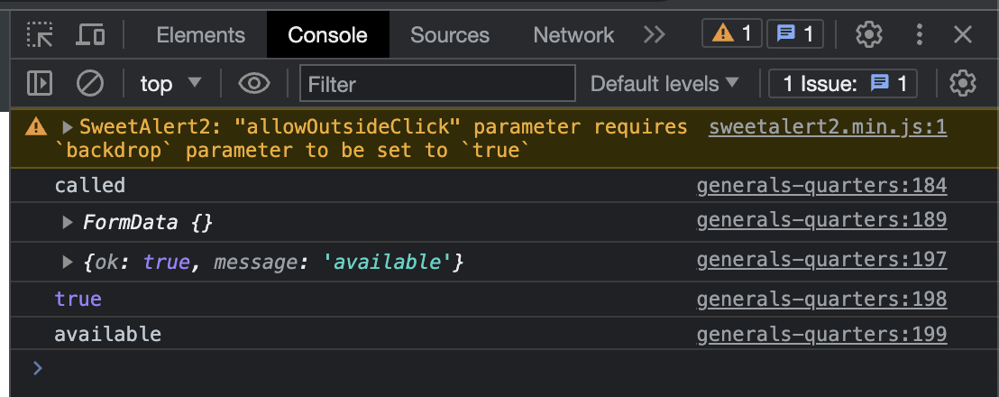

# Section 8: Converting our HTML to Go Templates, and creating handlers

## Lesson #064: Sending AJAX post and generalizing our custom function

- first we need to refactor our project
- replace all (CMD+SHIFT+R) path of imported packages from `063-sending-and-processing-an-ajax-request`
  to `064-sending-ajax-post-and-generalizing-our-custom-function`
- then edit go mod file

```shell
go mod edit -module github.com/SarathLUN/udemy-building-modern-web-applications-with-go/section-08/064-sending-ajax-post-and-generalizing-our-custom-function
```

- first we change route method from GET to POST

```go
    mux.Post("/search-availability-json", handlers.Repo.AvailabilityJSON)
```

- then we need to update javascript
- first we create form element
- then append the field `csrf_token`
- then we add change the fetch method to **POST** with body as formData

```javascript
            callback: function (result) {
    console.log("called");

    let form = document.getElementById("check-availability-form");
    let formData = new FormData(form);
    formData.append("csrf_token", "{{.CSRFToken}}");
    console.log(formData);

    fetch('/search-availability-json', {
        method: "post",
        body: formData,
    })
        .then(resp => resp.json())
        .then(data => {
            console.log(data);
            console.log(data.ok);
            console.log(data.message);
        });
}
```

- now let test from browser and make sure you view the browser console



- so now we are successfully change our route method to **POST**

---

- next we are going to make function `custom` to be more generalize, so that it can be re-usable
- so now we cut the `willOpen` and `didOpen` from file `base.layout.tmpl` to file `generals.page.tmpl`

```javascript
        attention.custom({
    title: 'Choose your dates',
    msg: html,

    willOpen: () => {
        const elem = document.getElementById("reservation-dates-modal");
        const rp = new DateRangePicker(elem, {
            format: 'yyyy-mm-dd',
            showOnFocus: true,
        })
    },

    didOpen: () => {
        document.getElementById("start").removeAttribute("disabled");
        document.getElementById("end").removeAttribute("disabled");
    },

    callback: function (result) {
        console.log("called");

        let form = document.getElementById("check-availability-form");
        let formData = new FormData(form);
        formData.append("csrf_token", "{{.CSRFToken}}");
        console.log(formData);

        fetch('/search-availability-json', {
            method: "post",
            body: formData,
        })
            .then(resp => resp.json())
            .then(data => {
                console.log(data);
                console.log(data.ok);
                console.log(data.message);
            });
    }
});
```

- and in file `base.layout.tmpl` we execute `willOpen` and `didOpen` only if it was initialized

```javascript
const {value: result} = await Swal.fire({
    title: title,
    html: msg,
    backdrop: false,
    focusConfirm: false,
    showCancelButton: true,
    willOpen: () => {
        // execute only if it defined
        if (c.willOpen !== undefined) {
            c.willOpen();
        }
    },
    didOpen: () => {
        // execute only if it defined
        if (c.didOpen !== undefined) {
            c.didOpen();
        }
    },
    preConfirm: () => {
        return [
            document.getElementById('start').value,
            document.getElementById('end').value
        ]
    }
});
```

- so now we can call function `custom` more wildly and past anything we want for the content.